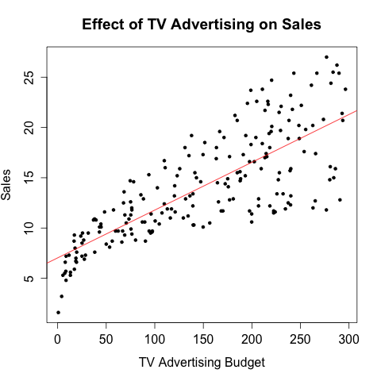

## Abstract

We analyze the relationship between television advertisement budget and unit sales of a particular product across a number of markets. To do this, we use a simple linear regression of Sales vs. Advertising budget. Based on our regression results, we conclude that a higher budget towards television advertisements is correlated with higher sales of a particular product.

## Introduction

Paid advertising generates the profits behind many forms of media - most prominintely television, but also websites, newspapers, radio, and other forms of media. Thus, the assumption that advertising generates additional sales is central to the survival of many forms of media - if companies were to cease paying for advertisements, many forms of media would be left without revenue. For this reason, the questions of whether advertisements are effective in boosting sales is an important topic not only to advertisers but to a wide variety of consumers.

In addition, companies developing advertisements may seek to predict the effects of advertising on their sales. We can also form a predictive model of sales based upon advertising budget - in this case, we predict sales based off of television advertising budget.

## Data

We use the `Advertising` dataset, which originally appeared in chapter 2.1 of "An Introduction to Statistical Learning", by Gareth James, Daniela Witten, Trevor Hastie and Robert Tibshirani. This datset consists of the `Sales` (in thousands of units) of a product across 200 different markets, along with advertising budgets (in thousands of dollars) for the product in each market, across three types of media: `TV`, `Radio`, and `Newspaper`. 

Histograms of the TV advertising budget by region, and Sales by region, are shown below:

[comment]: # (for PDF:)
\includegraphics[width=200pt]{../images/histogram-tv.png}
\includegraphics[width=200pt]{../images/histogram-sales.png}

[comment]: # (for HTML:)


## Methodology

We analyze the relatonship between TV advertising budget and Sales, across different markets. To do this, we use a simple linear model:

$$Sales = \beta_0 + \beta_1 * TV + \mu$$

Where "$Sales$" represents the total sales (in thousands of units) for a region, and "$TV$" represents the TV advertising budget for the region.

The coefficient the amount of product that would have been sold regardless of advertising, and $\beta_1$ represents the sensitivity of sales to advertising, that is, the increase in sales that can be expected from some increase in advertising budget. $\mu$ represents error due to factors beyond advertising, and random noise.

After defining this model, we fit the parameters $\beta_0$ and $\beta_1$ via a least-squares regression.

## Results

We compute the regression coefficients, and include a simmary below:

```{r chunk1,cache=TRUE,cache.extra=file.info('../data/regression.RData')[, 'mtime']}
load("../data/regression.RData")
print(model_summary)
```

A scatterplot of Sales vs TV advertising budget is shown below, with the least-squares regression line in red.

[comment]: # (for PDF:)
| \includegraphics[width=240pt]{../images/scatterplot-tv-sales.png} |
|-|

[comment]: # (for HTML:)
|  |
|-|

With an extremely low p-value, it is clear that there is a relationship between TV Advertising budget and Sales. Based on the values of $\beta_0$ and $\beta_1$ (notated in this table as the "(Intercept)" and TV" coefficients), we can conclude with 95% confidence that, in the abscence of advertising, sales will fall somewhere between 6,130 and 7,940 units (on average). We can also conclude that for each \$1,000 increase in television advertising, there will be an average increase in sales of between 42 and 53 units.

Conclusions:

Based on this analysis, it is clear that TV advertisements do have a positive correlation with product sales. As TV advertising budget increases, sales tend to increase by (on average), 48 per $1000 of advertising budget. The implications of this for both advertisers and media companies will depend on circumstances, but in general, our results support the hypothesis that television advertisements are effective in increasing product sales.
